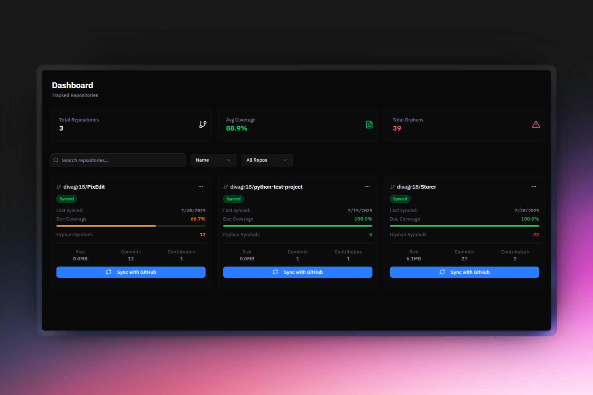
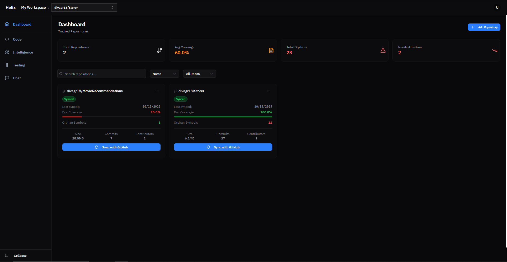
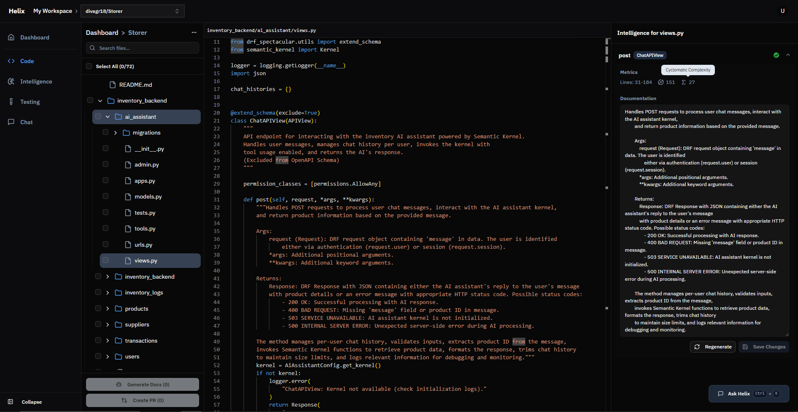
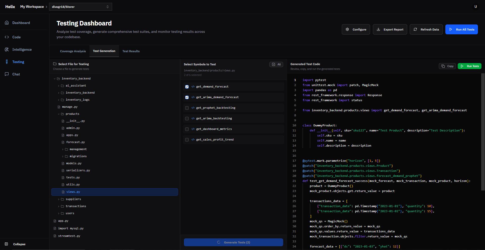

# Helix

Helix is an innovative platform designed to transform the way engineering teams interact with their codebase. Built on a high-performance Rust engine, Helix parses your entire codebase into a verifiable Merkle-hashed graph, enabling deep code understanding. 

Helix generates living documentation, surfaces architectural insights, and connects code to its runtime behavior. Refactor with confidence, generate and execute test cases, explore dependencies visually, and onboard faster with AI-powered explanations.




**Import from GitHub or upload local projects.** Helix automatically analyzes your code structure, detects all classes and functions, and maps dependencies between components. Get instant metrics like cyclomatic complexity and maintainability scores.

**Auto-generate documentation at every level.** Generate repository-level READMEs, module-level documentation, and function-level docstrings across your entire codebase. Keep documentation synchronized with code changes and revive outdated docs with AI assistance.

**Generate tests and refactoring recommendations.** Automatically create comprehensive test cases for untested code. Get intelligent refactoring suggestions based on complexity analysis and code patterns. Improve code quality with actionable recommendations.

**AI-powered code exploration.** Press **Ctrl+K** to chat with an intelligent assistant that understands your codebase. Ask questions, explore architecture, and get instant answers using vector search across your entire project.

**Complete privacy guaranteed.** Built with Django, React, and Rust, Helix runs entirely on your infrastructure with Docker. Your code never leaves your machine.

[](LICENSE)


## Table of Contents

- [Screenshots](#screenshots)
- [Features](#features)
- [Use Cases](#use-cases)
- [Prerequisites](#prerequisites)
- [Quick Start](#quick-start)
- [Usage](#usage)
- [Troubleshooting](#troubleshooting)
- [Contributing](#contributing)
- [License](#license)
- [Roadmap](#roadmap)


> **⚠️ Important Note**: Helix currently supports **Python projects only** for code analysis, diagram generation, and AI features. Multi-language support is planned for future releases.


## Screenshots

### Dashboard


### Code View


### Intelligence Dashboard


### Testing View



## Features

### Code Analysis (Python Only)
- Repository analysis with code structure mapping and quality metrics
- Symbol detection for classes, functions, and methods
- Dependency visualization showing code relationships
- Code metrics including lines of code, cyclomatic complexity, and maintainability scores
- Architecture diagram generation for Python projects

### GitHub Integration
- OAuth authentication for seamless login
- Repository import directly from GitHub
- Automatic workspace creation for new users
- Support for local repository uploads

### AI-Powered Features
- **Auto-generate documentation** at repository, module, and function levels
- **Generate missing docstrings** for entire codebases
- **Update stale documentation** to match current code
- **Create comprehensive READMEs** with usage examples and architecture overviews
- **Ctrl+K** shortcut to open chat from anywhere
- Vector search-powered Q&A about your codebase
- Automated test generation for Python code
- Code improvement suggestions and refactoring recommendations

### Privacy & Security
- All processing happens locally on your machine
- No code ever leaves your infrastructure
- Complete control over data and access


## Use Cases

### Documentation Generation & Maintenance
- Auto-generate repository-level READMEs with architecture overviews
- Create module-level documentation for all Python packages
- Generate missing docstrings across entire codebases
- Update outdated documentation to match current code
- Maintain live documentation synchronized with code changes
- Create comprehensive API documentation automatically

### Onboarding New Developers
- Auto-generate comprehensive project READMEs and documentation
- Quickly understand project architecture and code structure
- Navigate complex codebases with symbol detection and dependency graphs
- Ask the AI assistant questions about how systems interact
- Generate module-level documentation for all components

### Code Review & Quality Assurance
- Analyze code complexity metrics before merging
- Identify tightly coupled components and architectural issues
- Review maintainability scores across the codebase
- Ensure code quality standards are met

### Refactoring & Technical Debt
- Visualize dependencies before making changes
- Identify high-complexity functions that need refactoring
- Get AI-powered suggestions for code improvements
- Understand the impact of proposed changes

### Test Coverage Improvement
- Automatically generate test cases for untested code
- Identify gaps in test coverage
- Generate unit tests for legacy code
- Improve overall code reliability

### Legacy Code Understanding & Documentation
- Auto-generate missing documentation for undocumented codebases
- Create docstrings for all functions, classes, and methods automatically
- Update outdated documentation to reflect current implementation
- Map out undocumented codebases with AI-generated explanations
- Generate architecture diagrams and comprehensive READMEs
- Ask contextual questions about unfamiliar code

### Secure Development
- Keep sensitive codebases on your own infrastructure
- Analyze proprietary code without external API calls
- Maintain compliance with data privacy requirements
- Full control over code and analysis results

---

## Prerequisites

- Docker (20.10+) and Docker Compose (v2+)
- Git
- GitHub account (for OAuth authentication)


## Quick Start

### 1. Clone the Repository

```bash
git clone https://github.com/divagr18/Helix.git
cd Helix
```

### 2. Set Up Environment Variables

Create a `.env` file in the root directory:

```bash
cp .env.example .env
```

Edit `.env` and configure these required variables:

```env
# Django
DJANGO_SECRET_KEY=your-secret-key-here-generate-random-string
DJANGO_DEBUG=True
DJANGO_ALLOWED_HOSTS=localhost,127.0.0.1

# Database
POSTGRES_DB=helix_db
POSTGRES_USER=helix_user
POSTGRES_PASSWORD=your-secure-password
POSTGRES_HOST=db
POSTGRES_PORT=5432

# GitHub OAuth (Required for adding GitHub repos)
GITHUB_CLIENT_ID=your-github-client-id
GITHUB_CLIENT_SECRET=your-github-client-secret

OPENAI_API_KEY=your-openai-api-key
```

### 3. Set Up GitHub OAuth

Create a GitHub OAuth App:

1. Visit https://github.com/settings/developers
2. Click "New OAuth App"
3. Configure:
   - Application name: Helix
   - Homepage URL: `http://localhost:5173`
   - Authorization callback URL: `http://localhost:8000/accounts/github/callback/`
4. Copy Client ID and Client Secret to your `.env` file

### 4. Start the Application

```bash
docker-compose up -d
```

This starts all services:
- Backend (Django): http://localhost:8000
- Frontend (React): http://localhost:5173
- PostgreSQL database
- Redis cache
- Celery workers for background tasks

**Note:** On first startup, GitHub OAuth will be automatically configured from your environment variables. If you see OAuth errors, restart the backend container after adding your credentials.

### 5. Access the Application

Navigate to http://localhost:5173 and click "Continue with GitHub" to authenticate, or make a local account for local repo only usage.

### Technology Stack

Backend: Django 5.2.3, Django REST Framework, PostgreSQL with pgvector, Redis, Celery

Engine: Rust

Frontend: React 18, TypeScript, Vite, TailwindCSS, shadcn/ui

Infrastructure: Docker, Docker Compose

## Usage

### GitHub Repository Analysis

1. Login with your GitHub account
2. Navigate to Dashboard
3. Click "Import from GitHub"
4. Enter repository URL or select from your repositories
5. Wait for analysis to complete
6. Explore Code, Intelligence, and Testing views

### Local Repository Upload

1. Navigate to "Upload Local Repository"
2. Select a folder (up to 500 files)
3. Optionally provide a repository name
4. Click "Upload and Analyze"
5. View results in the repository dashboard

### Interface Navigation

- **Dashboard**: Repository overview and workspace management
- **Code View**: File browser, metrics, and symbol navigation
- **Intelligence**: Dependency graphs and code relationships
- **Testing**: Test coverage information
- **Chat**: AI assistant with vector search for Q&A, documentation generation, test creation, and more (Press **Ctrl+K** to open from anywhere in a repository)


## Troubleshooting

### Docker

Containers fail to start:
```bash
docker-compose logs backend
docker-compose logs frontend
docker-compose restart
```

Port already in use:
```bash
# Windows
netstat -ano | findstr :5173
# Mac/Linux
lsof -i :5173
```

### Database

Connection refused:
```bash
docker-compose ps
docker-compose down -v
docker-compose up -d
```

Migrations not applied:
```bash
docker-compose exec backend python manage.py migrate
```

### GitHub OAuth

Redirect URI mismatch:
- Verify callback URL: `http://localhost:8000/accounts/github/callback/`
- Check `ALLOWED_HOSTS` and `CSRF_TRUSTED_ORIGINS` in backend settings

OAuth app not configured:
```bash
docker-compose exec backend python manage.py setup_github_oauth
docker-compose restart backend
```

---

## Contributing

See [CONTRIBUTING.md](CONTRIBUTING.md) for contribution guidelines.

Quick steps:
1. Fork the repository
2. Create a feature branch
3. Make your changes
4. Submit a pull request


## License

MIT License - see [LICENSE](LICENSE) for details.


## Support

- Issues: [GitHub Issues](https://github.com/divagr18/Helix/issues)
- Discussions: [GitHub Discussions](https://github.com/divagr18/Helix/discussions)


## Roadmap

Completed:
- GitHub OAuth integration
- Local repository upload
- Code analysis and metrics
- Dependency visualization
- AI-powered chat assistant with vector search
- Auto-generate documentation (READMEs, module docs, docstrings)
- Update stale and missing documentation
- Automated test generation
- Code improvement suggestions and refactoring

Planned:
- Multi-language support (JavaScript, TypeScript, Java, etc.)
- Live documentation sync with code changes
- Multi-user collaboration
- CI/CD integration
- VS Code extension
