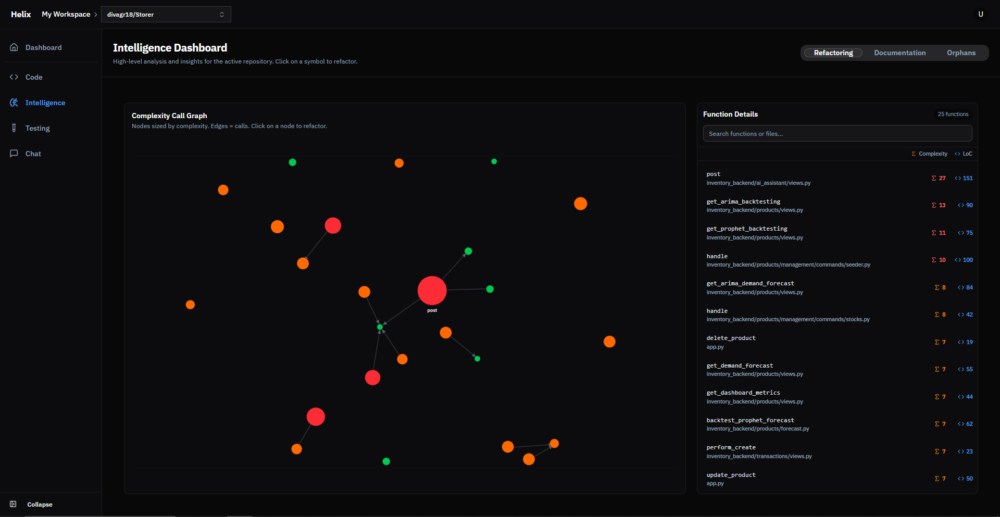

# Helix

A self-hosted code intelligence platform for analyzing and understanding Python codebases. Built with Django and React alongside a Rust parsing engine, Helix runs entirely on your local machine to ensure complete privacy and control over your code.

[](LICENSE)

---

## Table of Contents

- [Screenshots](#screenshots)
- [Features](#features)
- [Prerequisites](#prerequisites)
- [Quick Start](#quick-start)
- [Architecture](#architecture)
- [Usage](#usage)
- [Development](#development)
- [Troubleshooting](#troubleshooting)
- [Contributing](#contributing)
- [License](#license)
- [Security](#security)
- [Support](#support)
- [Roadmap](#roadmap)

---

> **⚠️ Important Note**: Helix currently supports **Python projects only** for code analysis, diagram generation, and AI features. Multi-language support is planned for future releases.

---

## Screenshots

### Dashboard


### Code View


### Intelligence Dashboard


### Testing View


---

## Features

### Code Analysis (Python Only)
- Repository analysis with code structure mapping and quality metrics
- Symbol detection for classes, functions, and methods
- Dependency visualization showing code relationships
- Code metrics including lines of code, cyclomatic complexity, and maintainability scores
- Architecture diagram generation for Python projects

### GitHub Integration
- OAuth authentication for seamless login
- Repository import directly from GitHub
- Automatic workspace creation for new users
- Support for local repository uploads

### AI-Powered Features
- **Ctrl+K** shortcut to open chat from anywhere
- Vector search-powered Q&A about your codebase
- Context-aware responses using repository embeddings
- Ask about architecture, functions, dependencies, and more
- Automated test generation for Python code
- Code improvement suggestions and refactoring recommendations

### Privacy & Security
- All processing happens locally on your machine
- No code ever leaves your infrastructure
- Complete control over data and access

---

## Prerequisites

- Docker (20.10+) and Docker Compose (v2+)
- Git
- GitHub account (for OAuth authentication)

---

## Quick Start

### 1. Clone the Repository

```bash
git clone https://github.com/divagr18/Helix.git
cd Helix
```

### 2. Set Up Environment Variables

Create a `.env` file in the root directory:

```bash
cp .env.example .env
```

Edit `.env` and configure these required variables:

```env
# Django
DJANGO_SECRET_KEY=your-secret-key-here-generate-random-string
DJANGO_DEBUG=True
DJANGO_ALLOWED_HOSTS=localhost,127.0.0.1

# Database
POSTGRES_DB=helix_db
POSTGRES_USER=helix_user
POSTGRES_PASSWORD=your-secure-password
POSTGRES_HOST=db
POSTGRES_PORT=5432

# GitHub OAuth (Required for adding GitHub repos)
GITHUB_CLIENT_ID=your-github-client-id
GITHUB_CLIENT_SECRET=your-github-client-secret

OPENAI_API_KEY=your-openai-api-key
```

### 3. Set Up GitHub OAuth

Create a GitHub OAuth App:

1. Visit https://github.com/settings/developers
2. Click "New OAuth App"
3. Configure:
   - Application name: Helix
   - Homepage URL: `http://localhost:5173`
   - Authorization callback URL: `http://localhost:8000/accounts/github/callback/`
4. Copy Client ID and Client Secret to your `.env` file

### 4. Start the Application

```bash
docker-compose up -d
```

This starts all services:
- Backend (Django): http://localhost:8000
- Frontend (React): http://localhost:5173
- PostgreSQL database
- Redis cache
- Celery workers for background tasks

**Note:** On first startup, GitHub OAuth will be automatically configured from your environment variables. If you see OAuth errors, restart the backend container after adding your credentials.

### 5. Access the Application

Navigate to http://localhost:5173 and click "Continue with GitHub" to authenticate, or make a local account for local repo only usage.

---

## Architecture

```
Helix/
├── backend/              # Django REST API
│   ├── config/           # Settings and configuration
│   ├── users/            # Authentication and user management
│   └── repositories/     # Code analysis and repository management
├── frontend/             # React + TypeScript UI
│   ├── src/
│   │   ├── components/   # Reusable components
│   │   ├── pages/        # Page components
│   │   ├── stores/       # State management
│   │   └── utils/        # Utility functions
└── docker-compose.yml    # Service orchestration
```

### Technology Stack

Backend: Django 5.2.3, Django REST Framework, PostgreSQL with pgvector, Redis, Celery

Frontend: React 18, TypeScript, Vite, TailwindCSS, shadcn/ui

Infrastructure: Docker, Docker Compose

---

## Usage

### GitHub Repository Analysis

1. Login with your GitHub account
2. Navigate to Dashboard
3. Click "Import from GitHub"
4. Enter repository URL or select from your repositories
5. Wait for analysis to complete
6. Explore Code, Intelligence, and Testing views

### Local Repository Upload

1. Navigate to "Upload Local Repository"
2. Select a folder (up to 500 files)
3. Optionally provide a repository name
4. Click "Upload and Analyze"
5. View results in the repository dashboard

### Interface Navigation

- **Dashboard**: Repository overview and workspace management
- **Code View**: File browser, metrics, and symbol navigation
- **Intelligence**: Dependency graphs and code relationships
- **Testing**: Test coverage information
- **Chat**: AI assistant with vector search (Press **Ctrl+K** to open from anywhere in a repository)

---

## Development

### Running Services Individually

Backend:
```bash
cd backend
python -m venv venv
source venv/bin/activate  # On Windows: venv\Scripts\activate
pip install -r requirements.txt
python manage.py migrate
python manage.py runserver
```

Frontend:
```bash
cd frontend
npm install
npm run dev
```

Celery worker (for async tasks):
```bash
cd backend
celery -A config worker --loglevel=info
```

Both frontend and backend support automatic hot-reloading.

### Testing

Backend:
```bash
cd backend
python manage.py test
```

Frontend:
```bash
cd frontend
npm run test
```

### Code Quality

Backend:
```bash
cd backend
ruff check .
```

Frontend:
```bash
cd frontend
npm run lint
```

---

## Troubleshooting

### Docker

Containers fail to start:
```bash
docker-compose logs backend
docker-compose logs frontend
docker-compose restart
```

Port already in use:
```bash
# Windows
netstat -ano | findstr :5173
# Mac/Linux
lsof -i :5173
```

### Database

Connection refused:
```bash
docker-compose ps
docker-compose down -v
docker-compose up -d
```

Migrations not applied:
```bash
docker-compose exec backend python manage.py migrate
```

### GitHub OAuth

Redirect URI mismatch:
- Verify callback URL: `http://localhost:8000/accounts/github/callback/`
- Check `ALLOWED_HOSTS` and `CSRF_TRUSTED_ORIGINS` in backend settings

OAuth app not configured:
```bash
docker-compose exec backend python manage.py setup_github_oauth
docker-compose restart backend
```

---

## Contributing

See [CONTRIBUTING.md](CONTRIBUTING.md) for contribution guidelines.

Quick steps:
1. Fork the repository
2. Create a feature branch
3. Make your changes
4. Submit a pull request

---

## License

MIT License - see [LICENSE](LICENSE) for details.

---

## Security

For security vulnerability reports, see [SECURITY.md](SECURITY.md).

---

## Support

- Issues: [GitHub Issues](https://github.com/divagr18/Helix/issues)
- Discussions: [GitHub Discussions](https://github.com/divagr18/Helix/discussions)

---

## Roadmap

Completed:
- GitHub OAuth integration
- Local repository upload
- Code analysis and metrics
- Dependency visualization
- AI-powered chat assistant with vector search
- Automated test generation
- Code improvement suggestions and refactoring

Planned:
- Multi-language support (JavaScript, TypeScript, Java, etc.)
- Multi-user collaboration
- CI/CD integration
- VS Code extension

---

Built with Django REST Framework, React, and shadcn/ui.
